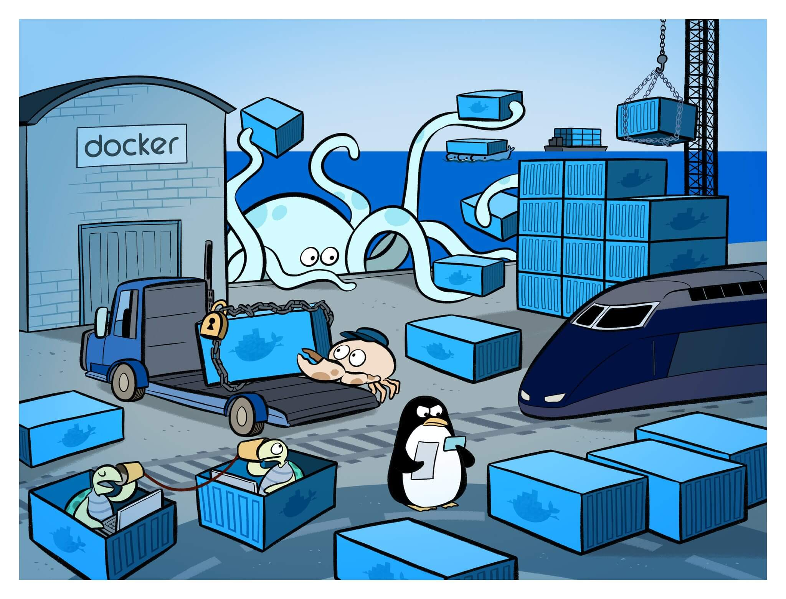
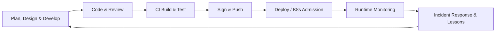

# Learn Supply Chain Security

> _In security, all we can ever do is raise the bar. Even with a fully secure end-to-end supply chain, all you've done is build a super secure malware delivery system if someone upstream decides to ship you malware._

The idea of a **supply chain** comes from manufacturing - it's the long chain of suppliers needs to produce a factory's output. Physical supply chains have been a mess since the pandemic, and software isn't much different.

**Supply chain attacks are on the rise**, leaking Personally Identifiable Information (PII), inserting ransomware and backdoors into healthcare, finance, government, and energy sectors, posing a **risk to human safety**.

Modern package managers (npm for JavaScript, pip for Python, cargo for Rust) automatically pull in hundreds if not thousands of direct and indirect (**transitive**) packages from cryptography to datepickers.

If you want to make most CVEs disappear, just **keeping Alpine and your package.json up-to-date** gets you most of the way there. What's left is the hard, trust-based stuff to get rid of.

Most open source maintainers are overworked volunteers. There are a lot of people you are trusting in that process. The MIT license says: "This software is provided 'as is'". If you use this, I owe you nothing. Don't expect or demand anything in return. All the risks are on you. **I am not a supplier**, there is no relationship. You are a racoon digging through dumpsters for free code.

## Core concepts

- **Supply Chain Security** protects the code and infrastructure turns an idea into running software.
  - Some regulators now demand it: a 20221 Executive Order (EO) 14028 in the US, Cyber Resilience Act (CRA) in the EU.
- **SLSA** (Supply-chain Levels for Software Artifacts) is a maturity framework. You can start a security noob at level 1, and work your way up.
- **NIST SP 800** is a US enterprise risk-management guidance for security handbooks.
- **CycloneDX** and **SPDX** are **SBOM** (Software Bill Of Materials) formats recommended in CISA.
- **sigstore** and **cosign** are keyless artifact signing.
- **OIDC providers** are the "Log in with Google/GitHub" of online identity built on OAuth 2.0.
- **in-toto** is a CNCF Graduated supply chain **attestation** framework.
- **Attestation** is a file format that contains metadata about what happens inside of a build. "The build input was: this repo, this commit, this make command, and got this binary with this hash."
- **Trivy** (Aqua), **Scout** (Docker), and **Grype** (Anchore, used by Chainguard because for false positive bias) are dependency/image scanners.
- **OPA / Conftest**, **Kyverno**, **Enforce** (Chainguard) are used for policy enforcement.
- **FIPS** image variants means the US government is willing to deploy it in their organizations.
- **Distroless** images don't include a package manager, web client (eg. curl), or even a shell.
- **SARIF** (Static Analysis Results Interchange Format) is a json format standard for static analysis tool output

## A brief history of notable supply-chain attacks

- In 2013, Target was compromised through their third-party HVAC vendor, leaking 40M credit cards.
- In 2017, NotPetya was compromised through malware inserted in their M.E.Doc updater, leading to $10B economic loss.
- In 2020, SolarWinds was compromised through their Orion build server, infecting 18K customers.
- In 2021, Codecov was compromised through their CI bash uploader, leaking the credentials of hundreds of orgs.
- In 2024, **xz** was narrowly thwarted when a rogue maintainer nearly backdoored OpenSSH. It was only caught because ssh took 0.5 seconds longer, dubbed "500 ms to midnight". Ubuntu 24 LTS delayed its release due to 15 packages depending on xz, including git itself.

## Continuous Security within the SDLC

## Trivia

- Post-quantum signing requirements will likely amend SLSA & EO 14028 guidance by 2027.
- Containers are just tarballs and json. You can compile images without Docker in some programming language. But if you were to build a Node.js app on your Macbook today, there may be some native C libraries that haven't been cross-compiled correctly. There are techniques but it's difficult.

## Memes & Hard Truths

- The US Government
- Build systems running on unpatched Jenkins machines under desks
- Everything should be machine-readable
- It only takes one mistake to sink a business.
- Engineers don't have the time to remediate CVEs while they are building products

## TODO

- [ ] Try Cloudsmith
- [ ] Introduce scanners in local, registry & production
- [ ] Contribute to a nascent tool (just coming into existence) like SBOM evaluator

## Ideas for DHI

- STIG variant

## Resources

- https://www.youtube.com/watch?v=yt0S_xN5b94
- Continue where you left off: https://courses.chainguard.dev/vulnerability-management-certification/115406