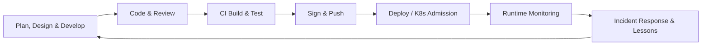

# FIPS

- **Federal Information Processing Standards (FIPS)** are US government rules for cryptography.
- FIPS is the standard for crypto modules like **OpenSSL** used in federal systems.
- **FIPS mode** disables insecure algorithms and enforces strict crypto settings.
# FedRAMP


- The US government is using Executive Orders to raise the bar for software supply chain security.
- **FedRAMP** (2022) requires US cloud providers to follow strict vulnerability rules.
  - Using **hardened** images (any not necessarily STIG) (a NIST 800-70 benchmark)
  - Scanning containers for vulnerabilities every 30 days
  - Tracking and remediating vulnerabilities on a deadline (eg. Critical/High in 30 days)
  - Using approved scanners

For more, see:  
- [Executive Order on Improving the Nation's Cybersecurity (2021)](https://www.whitehouse.gov/briefing-room/presidential-actions/2021/05/12/executive-order-on-improving-the-nations-cybersecurity/)  
- [FedRAMP Authorization Act (2022)](https://www.congress.gov/bill/117th-congress/house-bill/7776/text)  
- [National Cybersecurity Strategy (2023)](https://www.whitehouse.gov/wp-content/uploads/2023/03/National-Cybersecurity-Strategy-2023.pdf)
# Scanners

- A software vulnerability (vulns) is exploitable code that can be abused to compromise a computer system.
- Traditional scanners crawl container filesystems and query CVE databases.
- With SBOMs, you can short circuit that step by analyzing the exact packages without unpacking the image. Which makes sense since it's readonly!
- On any given day, Node, Go, Python, Nginx, and PHP have **more than 100 CVEs**, with dozens of high or criticals.
- Chainguard research shows popular images gain 1 new vulnerability per day on average, making remediation a never ending task.
- The **National Vulnerability Database** (NVD) is the official CVE source of truth, but it's slow and hard to query. So tools like Trivy, Grype, and Snyk maintain their own curated **indexes**.
- Registries don't know what's running in production. The best way to cut down code is **continously scan what's in production** in addition to before deployment.
- They start by pulling and caching an exhaustive list of CVEs from the NVD and **GitHub Advisory Database (GHAD)**
- By some estimates (Scorecard) 84% of all codebases have at least 1 vulnerability, with avg 158 per codebase. Most have been in the code for 2+ years and are fixable.
- **Software dark matter** are contents not tracked by a package manager. That is, the results may not reflect the true contents of the image.
- Scanners work by matching detected package names and versions to known CVEs from multiple databases (NVD, GHAD, vendor advisories).

## Choices

- **Grype** the most popular, open source, can be paired with **Syft** to generate SBOMs to feed into Grype for fast scans on every commit, and is used by Chainguard.
- **Trivy** is open source, and checks for other types of contents relevant to container security.
- **Docker Scout** is easy for local dev checks.
- Scorecard while not specifically a vuln scanner, rates you on your project's security posture.

## False positives vs. false negatives

- Scanners are not infallible
- False positives can happen if scanners detect vulns in unused code, or due to mismatched/incomplete data. False negatives can happen if **software isn't properly detected** or databases are missing info.
- Continuous scanning is important—new CVEs are found every day.
- There are too many vulnerabilities to quickly address, false positives, low severity score, and even some that don't merit the score they’ve been assigned. *COUGH--CURL9.8INTEGEROVERFLOW*
# Runtime & Dev variants

- Because distroless images don't include a **package manager** or **shell**, debugging requires a different approach.
- The **runtime** variant (eg. latest) is the production version.
- The **dev** variant (eg. latest-dev) includes tools like bash, git, and apk for easier debugging.
- You might also be able to use **Docker Debug** to attach to the runtime container.
# SBOM

- A **Software Bill of Materials (SBOM)** lists every library and dependency that goes into your app.
- Can't stop cyber attacks on their own.
- **Machine-readable**. Allows scanners to streamline the process to **quickly identify** packages with known vulnerabilities. No scanning the container filesystem.
- Have been around since the early 2000s, but Google Trends skyrocketed in 2021 when an Executive Order was signed that **required** SBOMs for **selling software to the US government**.
- 2 big standards: **SPDX** (Linux Foundation, 2011) and **CycloneDX**. SPDX started for license tracking, but now covers security and supply chain info too.
- Most SBOMs are still pretty rough—Chainguard Labs found only 1% of SBOMs from popular Docker containers met minimum requirements.
- Some folks think SBOMs are too much work for too little gain, but adoption is growing fast. 88% of companies planned to use them by 2023.
- SBOMs don’t fix vulnerabilities, but they make it way easier to find and fix what matters.
- SBOMs should be generated **during build** rather than from records. GitHub Actions is one of few that provide support for this approach.

## Fun fact

- SPDX's original purpose was to track OSS license compliance, so companies that wanted to do the right thing — like being "all MIT" or "no GPL" didn't find themselves in hot water. 
- Given OSS incorporate countless dependencies, it make sense to have trust issues! Devs and the US quickly recognized SBOMs could support other use cases
- In 2008, Cisco was violating free software licenses by distributing software in its Linksys routers

## SBOM drama!

- The **SolarWinds** hack (2020) showed how hard it is to track what's running where. If SBOMs were prevalent (no pun intended), finding and patching affected systems would have been much faster.

## Are you a SBOM pessimist, optimist, or optimist?

- I'm a **cautious optimist**. Are SBOMs the answer, or just more **digital paperwork**? Either way, they're here to stay. :)

## SBOM Quality

- **Not all SBOMs are created equal**.
- Chainguard abalyzed 3,000 popular Docker containers and found 1% of SBOMBs met the **minimum required elements**.
  - All 7 **data fields** (Author, timestamp, etc.)
  - **Automation support** (1 of 3 SBOM formats that are machine readable _and_ human readable)
  - **Practices and processes** including transitive dependencies and organizational documentation of any "known unknowns"
- The minimum elements, judging on analysis of this dataset, are a high bar and no tools appear to consistently create minimum elements-compliant SBOMs.

## Resources

- https://github.com/spdx/ntia-conformance-checker
- https://github.com/eBay/sbom-scorecard (Abandoned by eBay)# Wolfi

> The Wolfi octopus is the smallest known octopus.
> 
> 

- The most critical parts of vulnerability management comes before scanning, triaging, and patching. **Base images** are the very first layer of software you use to create a container.
- The `FROM` line of your Dockerfile does not tell you what's inside.
- No base image is perfect. To reduce risk, organizations will add layers to harden a **golden base image** they maintain and scan. This is like doing the **plumbing** in your own house.
- **Noisy scans** lead to **alert fatigue**. I would say 20 CVEs is the theoretical maximum for a team. If a scan returns 50+ CVEs, nobody will deal with it. Studies show 1% of CVEs are actually exploitable in real-world apps, so teams start to doubt if it's even a real threat.
- The solution? **Quiet base images**.

## What is distroless? You mean undistro?

- A **Linux distribution** is the Linux **kernel** plus a bunch of third-party **packages**. When you use OpenSSL on alpine, you aren't getting that from directly from the OpenSSL maintainers, you're getting that from a distribution that may have applied a few patches and thrown it into their package manager.
- In addition, Docker doesn't have a Linux kernel, instead relying on the host to provide this.
- So if you think about it, wolfi is really an **undistro**
- Containers don't package a Linux kernel (it uses the host's), therefore it's a distribution without Linux. It's **everything without Linux**. That gets into the "What is Linux? The kernel? The distribution? The package manager?" coversation which we'll skip.
- Distroless claim to be super secure, but they are notoriously difficult to debug.
- Chainguard like to think of wolfi as all the good of alpine, debian, and distroless, without any of the bad.
- Wolfi doesn't have desktop packages (KDE) or drivers. In fact, it defines one yaml file per package.
- This way you don't have to do tarball surgery, or limit yourself to what's in the Alpine distro.
- Chainguard found Distroless images accumulate new CVEs 5-6x more slowly than their counterparts

## Why not Alpine?

- Alpine gets you a lot of the way there, but still has some rough edges.
- **glibc** and **musl** (mshipped by Alpine for size) are 2 common implementations of the C standard library (libc). Applications don't talk to the OS or kerel directly, they go through this shim layer.
- Alpine only keeps packages that belong to main for 2 years. So running `apk add nodejs=14` will fail when the mirror no longer carries that APK.
- Scripts that assume a full-featured `sed` break# VEX

- The missing link between SBOMs and actionable security.
- **VEX** (Vulnerability Exploitability eXchange) tells you which CVEs you should actually care about enough. No manual **triaging**.
- Most scanners just **match package versions** to CVEs. VEX adds real-world context by leeting software suppliers say "yes, the code is there, but it's not reachable" or "already fixed."
- Cuts through the noise: 1000 CVEs in your SBOM? VEX might show only 10 are real risks.
- **Machine-readable** and designed for automation—triage at scale, not by hand.
- VEX status: **affected**, **not affected**, **fixed**, **under investigation**.
- Tools like Docker Scout and OpenVEX/vexctl help generate and consume VEX data.

Docker Scout shows ALL CVEs by default. To generate a report containing VEX affected CVEs only:

```sh
docker scout cves ubuntu --only-vex-affected
```

## vexctl

- **vexctl** is a CLI for working with VEX data
- **OpenVEX** (Chainguard, 2023) is a Go implementation of vexctl.
- The following command outputs valid VEX json that claims that APK package wolfi/git v2.38.1-r0 is NOT affected by CVE-2014-123456.

```sh
vexctl create --product="pkg:apk/wolfi/git@2.38.1-r0?arch=x86_64" \
                --vuln="CVE-2014-123456" \
                --status="not_affected" \
                --justification="inline_mitigations_already_exist"
```

Or simply,

```sh
vexctl create "pkg:apk/wolfi/git@2.39.0-r1?arch=x86_64" CVE-2023-12345 fixed
```
# Artifact attestations

- **SHA-256** only verifies that a file hasn't changed.
- An **attestation** answers "who, what, where, why, when?" questions that a simple hash can't.
- The link to the source commit, build instructions, dependencies, or build environment.
- Think of it like a **notarized affidavit**.

## Provenance

- The word comes from the art world. It's the "chain of custody" or record of every owner, sale, and exhibition in between back to the original artist's studio.
- In software, the origin is the repo, commit, and author that created it.
  - Who? (Michelangelo, Max)
  - What? (color from bazaar, SBOM)
  - Where? (on canvas, GitHub Actions)
  - Why? (commission, commit #123 to resolve issue #7)
  - When? (Early Renaissance, 1752725636)

- Provenance is obtained from attestation.
- With proper provenance, you can instantly query your records to find every single piece of software that was built with the vulnerable version of log4j
- Ideally this is **attached during build time**.
- **Sigstore** helps with keyless artifact signing!
# Learn Supply Chain Security


> _In security, all we can ever do is raise the bar. Even with a fully secure end-to-end supply chain, all you've done is build a super secure malware delivery system if someone upstream decides to ship you malware._

The idea of a **supply chain** comes from manufacturing - it's the long chain of suppliers needs to produce a factory's output. Physical supply chains have been a mess since the pandemic, and software isn't much different.

**Supply chain attacks are on the rise**, leaking Personally Identifiable Information (PII), inserting ransomware and backdoors into healthcare, finance, government, and energy sectors, posing a **risk to human safety**.

Modern package managers (npm for JavaScript, pip for Python, cargo for Rust) automatically pull in hundreds if not thousands of direct and indirect (**transitive**) packages from cryptography to datepickers.

If you want to make most CVEs disappear, just **keeping Alpine and your package.json up-to-date** gets you most of the way there. What's left is the hard, trust-based stuff to get rid of.

Most open source maintainers are overworked volunteers. There are a lot of people you are trusting in that process. The MIT license says: "This software is provided 'as is'". If you use this, I owe you nothing. Don't expect or demand anything in return. All the risks are on you. **I am not a supplier**, there is no relationship. You are a racoon digging through dumpsters for free code.

## Core concepts

- **Supply Chain Security** protects the code and infrastructure turns an idea into running software.
  - Some regulators now demand it: a 20221 Executive Order (EO) 14028 in the US, Cyber Resilience Act (CRA) in the EU.
- **SLSA** (Supply-chain Levels for Software Artifacts) is a maturity framework. You can start a security noob at level 1, and work your way up.
- **NIST SP 800** is a US enterprise risk-management guidance for security handbooks.
- **CycloneDX** and **SPDX** are **SBOM** (Software Bill Of Materials) formats recommended in CISA.
- **sigstore** and **cosign** are keyless artifact signing.
- **OIDC providers** are the "Log in with Google/GitHub" of online identity built on OAuth 2.0.
- **in-toto** is a CNCF Graduated supply chain **attestation** framework.
- **Attestation** is a file format that contains metadata about what happens inside of a build. "The build input was: this repo, this commit, this make command, and got this binary with this hash."
- **Trivy** (Aqua), **Scout** (Docker), and **Grype** (Anchore, used by Chainguard because for false positive bias) are dependency/image scanners.
- **OPA / Conftest**, **Kyverno**, **Enforce** (Chainguard) are used for policy enforcement.
- **FIPS** image variants means the US government is willing to deploy it in their organizations.
- **Distroless** images don't include a package manager, web client (eg. curl), or even a shell.
- **SARIF** (Static Analysis Results Interchange Format) is a json format standard for static analysis tool output

## A brief history of notable supply-chain attacks

- In 2013, Target was compromised through their third-party HVAC vendor, leaking 40M credit cards.
- In 2017, NotPetya was compromised through malware inserted in their M.E.Doc updater, leading to $10B economic loss.
- In 2020, SolarWinds was compromised through their Orion build server, infecting 18K customers.
- In 2021, Codecov was compromised through their CI bash uploader, leaking the credentials of hundreds of orgs.
- In 2024, **xz** was narrowly thwarted when a rogue maintainer nearly backdoored OpenSSH. It was only caught because ssh took 0.5 seconds longer, dubbed "500 ms to midnight". Ubuntu 24 LTS delayed its release due to 15 packages depending on xz, including git itself.

## Continuous Security within the SDLC



## Trivia

- Post-quantum signing requirements will likely amend SLSA & EO 14028 guidance by 2027.
- Containers are just tarballs and json. You can compile images without Docker in some programming language. But if you were to build a Node.js app on your Macbook today, there may be some native C libraries that haven't been cross-compiled correctly. There are techniques but it's difficult.

## Memes & Hard Truths

- The US Government
- Build systems running on unpatched Jenkins machines under desks
- Everything should be machine-readable
- It only takes one mistake to sink a business.
- Engineers don't have the time to remediate CVEs while they are building products
- Crack it open

## TODO

- [ ] Try Cloudsmith
- [ ] Introduce scanners in local, registry & production
- [ ] Contribute to a nascent tool (just coming into existence) like SBOM evaluator

## Ideas for DHI

- STIG variant

## Resources

- https://www.youtube.com/watch?v=yt0S_xN5b94
- Continue where you left off: https://courses.chainguard.dev/vulnerability-management-certification/115406# CISA KEV Catalog

- **Known Exploited Vulnerabilities (KEV)** is a **catalog** maintained by CISA that documents which CVEs have **known exploits**. KEV will be discussed in the next lesson.
- They can get **cool names** and federal agencies must remediate vulnerabilities in this catalog by a due date specified by CISA
- Heartbleed (2014) was a compromise when OpenSSL allowed an attacker to read the memory of a system without detection.
- Shellshock (2014) went unnoticed for 25 years, existing in Bash since 1989. Botnets were deployed against high-profile entities like the US Department of Defense.
- Log4Shell (2021) was a compromise when a popular Java logging util with remote code execution.
# STIG

- **Security Technical Implementation Guides (STIG)** is a **free guide** for hardening software used in the US Department of Defense.
- Mandated by the DoD, Navy, Air Force, etc.
- Not available as an ISO. You apply the STIG to a standard Ubuntu installation from DISA or Canonical.
- **Iron Bank** is a registry by the US Department of Defense. does not store the textual STIG PDFs or checklists themselves. It instead provides containers already configured in accordance with those STIGs.
- There is a **significant lag** in release, **2 years** for Ubuntu 22.04 STIG.
- Includes Red Hat Enterprise Linux (RHEL), Ubuntu 22.04 STIG, Docker Enterprise STIG


## Resouces

- https://repo1.dso.mil/dsop# SLSA

**SLSA** (pronounced "salsa") is an approachable security framework designed to protect the integrity of software supply chains that you can **incrementally** implement, starting from level 1.

- **SLSA 2 would have been enough** to help prevent the **xz** attack, since the tarballs contained extra code not present in the commit.
- SLSA 4 would have made the social engineering part of the xz attack dramatically harder, since it requires 2 person code review.

Modern software is built on complex supply chains, making it vulnerable to attacks such as build system compromises, say if someone has the build server under their desk.

- **SLSA 1: Documentation of the build process** Requires that the build process is fully scripted and automated.
- **SLSA 2: Tamper-evident build service** Requires version control and provenance (metadata about how the artifact was built).
- **SLSA 3: Non-falsifiable provenance** Requires a build service that is resistant to tampering and can generate verifiable provenance.
- **SLSA 4: Two-person review and hermetic builds** Requires the highest level of security, including two-person review and isolated, reproducible builds.
# Customize

- Imagine you have a binary with curl as a dependency
- Installing them via wolfi-base, which has apk, sacrifices distroless
- Instead, Chainguard recommends using tooling like **melange** and **apko** to customize base images.
- **Assemble** is Chainguard's commercial offering.
# CVE

- A CVE, **Common Vulnerabilities and Exposures**, is a vulnerability that has been reported and accepted by the CVE Program.
- There are over **200K CVEs** as of 2025.
- Over 300 **CVE Numbering Authorities (CNA)** like Apple or Microsoft issue **CVE IDs**, the unique identifier that details the product impacted, version of the product, and vulnerability iteself with a **criticallity score**.
- The **Common Vulnerability Scoring System (CVSS)** assess the severity on a scale of 0-10 and was launched in 2005 by the non-profit Forum of Incident Response and Security Teams (FIRST).
- The format is CVE-YYYY-NNNNN, where YYYY stand for the year, and NNNNN is a unique sequential number.
- The CVE Program was founded by non-profit **MITRE** in 1999 as a free database for security researchers to understand the impact of vulnerabilities deployed in their network.
- Funding is provided by the **Cybersecurity & Infrastructure Security Agency (CISA)** and **US Department of Homeland Security (DHS)**. 

## CVE drama alert!

- In 2025, the program was 24 hours from shutdown from a last-minute 11 month contract extension from CISA.
- Without them, third-parties would scramble to fill the power vaccuum with paid databases, fracturing identifiers and terminology.

## More CVE drama!!

- CVSS 3, which was in place from 2015-2023, faced backlash from OSS maintainers for its subjectiveness and lack of context.
- In 2023, NVD scorers assigned an anonymous 1-line report of a benign integer overflow in curl. When the `--retry-delay` option would multiply seconds to milliseconds, it would rollover on a 64-bit machine. Instead of waiting until the end of the universe, it might retry in a second. 
- They assigned 9.8 CRITICAL without involving the curl team, spreading disinformation across the world.
- Since it was reported on HackerOne in 2019, they assigned the YYYY as 2020. Wtf? 
- The maintainer of curl even responded to the original 2019 HackerOne report after 2 days, fixed, closed it while the reporter said it can't be exploited. It had been dealt with.
- It's still worth putting it in the CVE database, since people could be running a 4 year old version of curl. But wtf it's not a security issue?!
- MITRE eventually dropped it to a 3.3 LOW.
